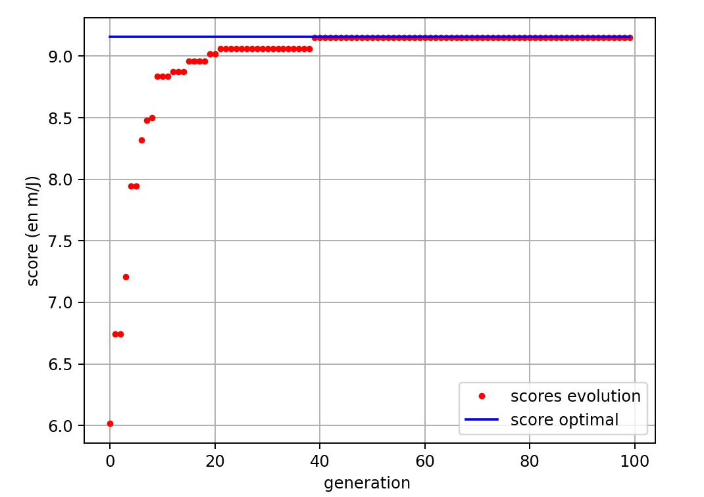
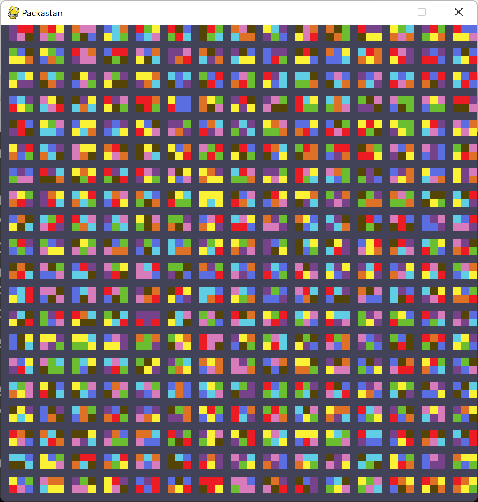

# PORTFOLIO
  Je suis Damien Maitre, ingénieur étudiant à l'Ecole Nationale des Ponts et Chaussées. Je présente ici plusieurs projets dont je suis fier, à destination de recruteurs potentiels. Vous trouverez une rubrique _Développement logiciel_ et une rubrique _Prototypage et mécanique_. 

### Contacts :
  - +33 7 83 41 50 90
  - damien.maitre@live.fr

# PROTOTYPAGE ET MECANIQUE
  J'étudie à l'Ecole Nationale des Ponts et Chaussées la Mécanique des matériaux, l'Aéro- & Hydro-dynamisme et le Prototypage. Ces 2 années de formation m'ont donné l'occasion de participer à de nombreux projets.

## 2024-2025 - Projet de 2A : Conception d'un SEA-GLIDER, planeur longue portée sous-marin

## 2024-2025 - Porjet de 2A : Conception d'un drone à aile rhomboédrique

## 2024 - Atelier design d'une semaine : Pont suspendu en bois de 7m de portée
  L'ENPC organise tous les ans les Ateliers Design : par groupes de 6, mixés avec des étudiants en Design et en Architecture, nous avions une semaine pour concevoir, construire, essayer et détruire quelque chose. **Mon groupe devait construire un Pont en bois.**

  Nous avons choisi, par originalité, de dessiner un pont suspendu, qui tienne simplement en étant posé sur deux tables. Le cahier des charges était le suivant : 
   - 7m de portée
   - Pouvoir supporter toute l'équipe en chargement, soit 450kg
   - Effort sur le bilan écologique du pont & concours d'ACV

   
   _maquette en spaghetti du pont pour des essais en chargement_

  Le pont a la dynamique d'une poutre simple. Le chargement vers le bas est réparti dans les ailes latérales, composées de poutres en treillis. Ces poutres tirent à leur tour le segment supérieur des ailes, qui repose sur le support (les deux tables). En chargement, le pont se déforme ainsi comme une poutre simple : en flexion, de manière symétrique autour du voyageur. 

  
  
  _le produit fini_

  Nous lions les planches avec des vis et des boulons, mais la flexibilité du bois donne du jeu aux intersections des planches. Le pont vu de face a la dynamique d'un carré rotulé, il n'est pas stable. Pour fixer la rotation des planches dans les sections normales au sens de traversée, nous ajoutons un élément qui gêne la traversée.

   
   _la pyramide du milieu empêche les deux ailes de battre sur les côtés_

   

# DEVELOPPEMENT LOGICIEL
  J'ai appris la programmation en autodidacte avant le lycée. Je connais le C++, le C# et le Python. J'ai aussi fait du développement web basique et du Java. Voici plusieurs projets plus ou moins aboutis.

## 2024 - Projet de 1A : Apprendre à des créatures aquatiques simulées à nager via IA

  Nous voulions simuler la sélection naturelle, vue comme un algorithme d'apprentissage automatique, sur un cas simple : apprendre à des créatures simulée à nager dans un liquide. Nous avons réalisé un _algorithme génétique_ : Une population reçoit un score en fonction de son aisance à se déplacer, les meilleures créatures sont conservées et se reproduisent, produisant la génération suivante.

  
  
  
  _nos créatures ressemblaient à ça_

    __Simulation et reproduction__
  Nous devions calculer les performances de nos créatures et donc les modéliser dans un fluide. Le projet a nécessité une étude mêlant mécanique des fluides et dynamique des structures. Nous sommes arrivés à un calcul simplifié des forces de jet et de traînée qui soit applicable à une créature avec une morphologie et des mouvements quelconques.

  Nos créatures étaient diverses et varées. Nous ne voulions pas guider l'exploration algorithmique de l'espace des solutions, et donc nous nous sommes permis des créatures de taille aléatoires. Le deuxième enjeu était donc de faire reproduire deux créatures dont la morphologie pouvait être complètement différente pour produire un nouvel individu. La convergence de l'algorithme réside dans la reproduction : si les nouveaux individus sont trop loins de leurs parents, alors l'espace exploré est trop large et nous sommes proches d'une exploration aléatoire. Au contraire, si les enfants sont des copies conformes de leurs parents, le sous-ensemble exploré est très faible.

    __Résultats__
  
  _simulations typique de plusieurs générations. La variable représentée sur l'axe vertical est croissante avec la distance parcourue par la créature, mais décroissante avec l'énergie musculaire dépensée. C'est ce critère qui nous permettait de classer les créatures_

  Nous obtenons des simulations qui convergent vers deux types d'individus. Nos premiers résultats furent des méduses composés de 3 noeuds, qui avancaient en ouvrant puis en fermant leur articulation. En augmentant les probabilités de mutations agrandissantes à chaque reproduction, nous avons aussi pu obtenir des serpents composés d'un grand nombre d'articulations formant une ligne droite et se déplaçant en ondulant. 
  
  
  _Les cycles de déplacement typiques de nos créatures_

## 2022-2023 - TIPE de Prépa : Optimisation du positionnement des bâtiments fonctionnels au sein d'une ville

  Cet étude avait pour sujet la disposition des bâtiments fonctionnels au sein d'une ville (comprendre tout sauf les habitations). Nous avons simulé des villes entières, simulé leurs habitants qui, selon leurs besoins, se déplaçaient vers les bons bâtiments et revenaient chez eux. Notre étude visait à compter, pour chaque bâtiment fonctionnel, le temps moyen mis par ses visiteurs à y parvenir en utilisant le réseau routier, que nous interprétions comme une mesure de son bon ou mauvais positionnement (nous appelerons ce critère le _k\_bien_). Ces données étaient exploitées par un algorithme d'apprentissage renforcé qui échangait des bâtiments pour tendre vers une ville à la disposition idéale.

    __Les habitants__

  \t Nous devons donc simuler des habitants et leurs va-et-viens. Nous nous sommes basés sur la pyramide de Maslow pour définir les besoins de nos habitants, dont nous avons extrait 9 besoins mis en bijection avec une certaine catégorie de bâtiments. Chaque habitant a donc, au cour d'une simulation, 9 jauges qui décroissent tant que le besoin qu'elles représentent n'a pas été choisi. A chaque fois que l'habitant est de retour chez lui, il choisit la jauge la plus faible. Notons aussi que la vitesse de décroissance des jauges est reglée selon la pyramde de Maslow.
  
  _la pyramide de Maslow_

  
  _Jauges d'un habitant pendant quelque tours_

    __Etape 1 : ville abstraite__

  
  
  Nous avons en premier lieu testé nos modèles et notre algorithme d'apprentissage sur une ville dessinée par nos soins : un simple damier de bâtiments aléatoires entourés par des routes (ci-dessus). Voici la différence entre le premier calcul de _k\_bien_ sur une disposition aléatoire et la disposition asymptotique atteinte.

  
  _la première simulation_

  
  _la disposition asymptotique_

    __Etape 2 : modéliser Strasbourg__
  
  
  Une fois le modèle testé et approuvé, nous avons cherché à l'effectuer sur une vraie ville : Strasbourg.
  Des nouvelles procédures s'ajoutent. Nous avons réussi, grâce à la base de données d'OpenStreetMap, à récupérer l'intégralité des bâtiments sur une zone géographique voulue, plus précisemment leurs positions géographiques, leurs surfaces et le besoin auxquel ils répondaient. Nous avons exploité cette base pour construire un graphe représentant le réseau routier entier de la zone d'intérêt. Enfin, ces constructions prenant plusieurs dizaines de minutes, nous avons trouvé un format de sérialisation pour sauvegarder des villes déjà construites. Une fois ces villes importées, le modèle marchait. Voici les résultats :

  
  _calcul du k\_bien de la ville_

  
  _calcul du k\_bien sur la disposition asymptotique atteinte_

## 2020 - Interface moderne pour une station alarme, calendrier et domotique
