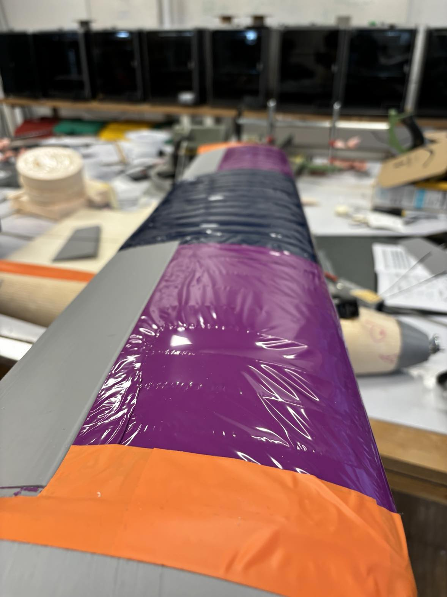

# PORTFOLIO
  Je suis Damien Maitre, ingénieur étudiant à l'Ecole Nationale des Ponts et Chaussées. Je présente ici plusieurs projets dont je suis fier, à destination de recruteurs potentiels. Vous trouverez une rubrique _Développement logiciel_ et une rubrique _Prototypage et mécanique_. 

### Contacts :
  - +33 7 83 41 50 90
  - damien.maitre@live.fr

### Sommaire
 1. [Prototypage et mécanique](#prototypage-et-mecanique)
  - [Conception d'un SEA-GLIDER](#2024-2025---projet-de-2a--conception-dun-sea-glider-planeur-longue-portée-sous-marin)
  - [Conception d'un drone à ailes rhomboédriques](#2024-2025---porjet-de-2a--conception-dun-drone-à-aile-rhomboédrique)
  - [Conception d'un pont suspendu en bois de 7m](#2024---atelier-design-dune-semaine--pont-suspendu-en-bois-de-7m-de-portée)

  2. [Développement logicel](#developpement-logiciel)
   - [créatures IA capable de nager dans un fluide](#2024---projet-de-1a--apprendre-à-des-créatures-aquatiques-simulées-à-nager-via-ia)

   - [Optimisation de la disposition des bâtiments dans une ville](#2022-2023---tipe-de-prépa--optimisation-du-positionnement-des-bâtiments-fonctionnels-au-sein-dune-ville)

# PROTOTYPAGE ET MECANIQUE
  J'étudie à l'Ecole Nationale des Ponts et Chaussées la Mécanique des matériaux, l'Aéro- & Hydro-dynamisme et le Prototypage. Ces 2 années de formation m'ont donné l'occasion de participer à de nombreux projets.

## 2024-2025 - Projet de 2A : Conception d'un SEA-GLIDER, planeur longue portée sous-marin

  _(Projet en cours)_

  Nous concevons actuellement à trois un prototype complet de SEA-GLIDER. Grâce à un système de ballasts, l'engin oscille dans l'axe vertical entre la surface et 5m de fond. Ce mouvement vertical génère donner une poussée vers l'avant grâce à deux ailes, comme un planeur. 
  
  #### Fonctionnement

  Les ailes sont plates (pour que la poussée soit la même en plongée et en montée), et doivent avoir un angle d'assiette du bon signe pour que la résultante des forces de pression soit toujours dirigée vers l'avant. Le SEA-GLIDER "plane" dans l'eau comme un cerf-volant ou un avion en papier : avec son angle d'assiette plus que par un profil d'aile particulier. Pour faire tanguer l'appareil dans le bon sens, nous contrôlons la position du centre de gravité grâce à des masselottes. L'écart entre ce dernier et le centre de poussée hydrodynamique qui lui est fixe créé l'angle d'assiette désiré. Les masselottes peuvent générer un angle de tanguage mais aussi de roulis, qui sert à faire tourner l'appareil sous l'eau.

## 2024-2025 - Projet de 2A : Conception d'un drone à aile rhomboédrique

  Nous concevons à quatre un objet volant à aile rhomboédrique. L'idée est de supprimer les tourbillons marginaux à la périphérie des ailes en les reliant.

  
  _L'avion avant l'essai_

  #### L'intérêt de l'aile rhomboédrique

  Une aile créé de la portance, c'est-à-dire que la résultante des forces de pression exercées par l'air n'est pas nulle et pointe vers le haut. Cela signifie aussi que la pression au dessus de l'aile est inférieure à la pression en dessous sur laquelle repose l'aile. A la frontière de l'aile, ce gradient de pression existe toujours et produit un écoulement parasite : l'air au dessous de l'aile est poussé vers le haut et produit un tourbillon. Ce tourbillon est une zone de chaos turbulente dans laquelle les conditions de portance ne sont plus réunies.

  Ces tourbillons existent parce que l'aile s'arrête. Nous voulons concevoir un biplan dont les deux plans d'ailes soient reliés entre eux par un segment vertical. Ainsi, l'air au dessus ne rejoint plus l'air au dessous, et nous supprimons les tourbillons turbulents. 

#### Etude

  Notre approche fut de calculer d'abord la position optimale en terme de finesse (rapport portance sur trainée) des deux plans d'ailes. Nous avons pour cela parcouru l'espace des positions avec le logiciel de CFD StarCCM+. Nous avons découvert, en 2D, l'inutilité d'un biplan : il est plus efficace de prendre l'aile du dessus et de la coller au bout de l'aile du dessous. L'espoir demeure pourtant sur l'idée de joindre ces deux ailes, les écoulements marginaux comptant environ pour 30% de la traînée d'un aéronef.

  
  _Représentation graphique de la vitesse du fluide, résultat convergé_

#### Construction de l'avion

  Le fuselage est en polystyrène usiné et renferme une antenne, un moteur et une batterie. Les ailes sont constituées de sections en bois balza découpé au laser, tenues par des tubes de carbone. Les bords de fuite, d'attaque et les ailerons sont imprimés en 3D. L'aile est ensuite entoilée à l'aide d'un film thermocollant. Enfin, les jonctions sont imprimées en 3D. Le profil passe d'un Wortman FX à un profil symétrique NACA 0010 (l'aile verticale ne doit rien porter au risque de déstabiliser l'avion).
  
  _Gros plan sur l'aile_

  
  _Une des deux sections verticales_

#### Essais

  Il est très difficile d'évaluer les performances de l'avion. Notre avion est petit, et nous n'avons pas réussi à stabiliser les points d'applications des forces aéronautiques. Pour qu'un avion reste stable, il faut absolument que les centres de portance, de traînée, de poussée moteur et de gravitée soit confondus, sinon l'avion bascule. Ce fut un point sous-estimé lors de la construction. Avec en plus le vent, les deux ailes qui traînent et l'angle de jeté sans doute un peu généreux, notre aéroplane est immédiatement parti en looping (2 tours et demi !) avant de retomber sur le sol. Une perspective évidente est donc d'équilibrer l'avion : remonter le moteur au milieu des deux ailes, et raccourcir l'empennage pour aligner barycentre et centre de portance. Un décolage classique avec une route et un train est sans doute aussi plus fiable qu'un lanceur de drones amateur. Remarquons enfin qu'intrinsèquement, les deux ailes verticales créent une trainée énorme si le vent n'est pas parfaitement aligné avec l'avion.

  
  _L'épave post-cabrioles_

## 2024 - Atelier design d'une semaine : Pont suspendu en bois de 7m de portée
  L'ENPC organise tous les ans les Ateliers Design : par groupes de 6, mixés avec des étudiants en Design et en Architecture, nous avions une semaine pour concevoir, construire, essayer et détruire quelque chose. **Mon groupe devait construire un Pont en bois.**

  Nous avons choisi, par originalité, de dessiner un pont suspendu, qui tienne simplement en étant posé sur deux tables. Le cahier des charges était le suivant : 
   - 7m de portée
   - Pouvoir supporter toute l'équipe en chargement, soit 450kg
   - Effort sur le bilan écologique du pont & concours d'ACV

   
   _maquette en spaghetti du pont pour des essais en chargement_

  Le pont a la dynamique d'une poutre simple. Le chargement vers le bas est réparti dans les ailes latérales, composées de poutres en treillis. Ces poutres tirent à leur tour le segment supérieur des ailes, qui repose sur le support (les deux tables). En chargement, le pont se déforme ainsi comme une poutre simple : en flexion, de manière symétrique autour du voyageur. 

  
  
  _le produit fini_

  Nous lions les planches avec des vis et des boulons, mais la flexibilité du bois donne du jeu aux intersections des planches. Le pont vu de face a la dynamique d'un carré rotulé, il n'est pas stable. Pour fixer la rotation des planches dans les sections normales au sens de traversée, nous ajoutons un élément qui gêne la traversée.

   
   _la pyramide du milieu empêche les deux ailes de battre sur les côtés_

   

   Le problème principal du pont est le flambement. Lorsqu'on appui suffisament sur une poutre dans son sens longitudinal, elle se déforme de manière instable en formant une déformée de forme sinusoidale (résultat qu'on obtient en appuyant sur les bords d'une règle souple). Notre pont a le même problème : les arètes du haut flambent énormément.

# DEVELOPPEMENT LOGICIEL
  J'ai appris la programmation en autodidacte avant le lycée. Je connais le C++, le C# et le Python. J'ai aussi fait du développement web basique et du Java. Voici plusieurs projets plus ou moins aboutis.

## 2024 - Projet de 1A : Apprendre à des créatures aquatiques simulées à nager via IA

  Nous voulions simuler la sélection naturelle, vue comme un algorithme d'apprentissage automatique, sur un cas simple : apprendre à des créatures simulée à nager dans un liquide. Nous avons réalisé un _algorithme génétique_ : Une population reçoit un score en fonction de son aisance à se déplacer, les meilleures créatures sont conservées et se reproduisent, produisant la génération suivante.

  
  
  
  _nos créatures ressemblaient à ça_

  #### Simulation et reproduction

  Nous devions calculer les performances de nos créatures et donc les modéliser dans un fluide. Le projet a nécessité une étude mêlant mécanique des fluides et dynamique des structures. Nous sommes arrivés à un calcul simplifié des forces de jet et de traînée qui soit applicable à une créature avec une morphologie et des mouvements quelconques.

  Nos créatures étaient diverses et varées. Nous ne voulions pas guider l'exploration algorithmique de l'espace des solutions, et donc nous nous sommes permis des créatures de taille aléatoires. Le deuxième enjeu était donc de faire reproduire deux créatures dont la morphologie pouvait être complètement différente pour produire un nouvel individu. La convergence de l'algorithme réside dans la reproduction : si les nouveaux individus sont trop loins de leurs parents, alors l'espace exploré est trop large et nous sommes proches d'une exploration aléatoire. Au contraire, si les enfants sont des copies conformes de leurs parents, le sous-ensemble exploré est très faible.

  #### Résultats

  
  _simulations typique de plusieurs générations. La variable représentée sur l'axe vertical est croissante avec la distance parcourue par la créature, mais décroissante avec l'énergie musculaire dépensée. C'est ce critère qui nous permettait de classer les créatures_

  Nous obtenons des simulations qui convergent vers deux types d'individus. Nos premiers résultats furent des méduses composés de 3 noeuds, qui avancaient en ouvrant puis en fermant leur articulation. En augmentant les probabilités de mutations agrandissantes à chaque reproduction, nous avons aussi pu obtenir des serpents composés d'un grand nombre d'articulations formant une ligne droite et se déplaçant en ondulant. 
  
  
  _Les cycles de déplacement typiques de nos créatures_

## 2022-2023 - TIPE de Prépa : Optimisation du positionnement des bâtiments fonctionnels au sein d'une ville

  Cet étude avait pour sujet la disposition des bâtiments fonctionnels au sein d'une ville (comprendre tout sauf les habitations). Nous avons simulé des villes entières, simulé leurs habitants qui, selon leurs besoins, se déplaçaient vers les bons bâtiments et revenaient chez eux. Notre étude visait à compter, pour chaque bâtiment fonctionnel, le temps moyen mis par ses visiteurs à y parvenir en utilisant le réseau routier, que nous interprétions comme une mesure de son bon ou mauvais positionnement (nous appelerons ce critère le _k\_bien_). Ces données étaient exploitées par un algorithme d'apprentissage renforcé qui échangait des bâtiments pour tendre vers une ville à la disposition idéale.

  #### Les habitants

  Nous devons donc simuler des habitants et leurs va-et-viens. Nous nous sommes basés sur la pyramide de Maslow pour définir les besoins de nos habitants, dont nous avons extrait 9 besoins mis en bijection avec une certaine catégorie de bâtiments. Chaque habitant a donc, au cour d'une simulation, 9 jauges qui décroissent tant que le besoin qu'elles représentent n'a pas été choisi. A chaque fois que l'habitant est de retour chez lui, il choisit la jauge la plus faible. Notons aussi que la vitesse de décroissance des jauges est reglée selon la pyramde de Maslow.

  
  _la pyramide de Maslow_

  
  _Jauges d'un habitant pendant quelque tours_

  #### Etape 1 : ville abstraite

  
  
  Nous avons en premier lieu testé nos modèles et notre algorithme d'apprentissage sur une ville dessinée par nos soins : un simple damier de bâtiments aléatoires entourés par des routes (ci-dessus). Voici la différence entre le premier calcul de _k\_bien_ sur une disposition aléatoire et la disposition asymptotique atteinte.

  
  _la première simulation. La carte à gauche représente les fonctions des différents bâtiments : 9 besoins plus les routes_

  
  _la disposition asymptotique_

  #### Etape 2 : modéliser Strasbourg
  
  

  Une fois le modèle testé et approuvé, nous avons cherché à l'appliquer sur une vraie ville : Strasbourg.
  Des nouvelles procédures s'ajoutent. Nous avons réussi, grâce à la base de données d'OpenStreetMap, à récupérer l'intégralité des bâtiments sur une zone géographique voulue, plus précisemment leurs positions géographiques, leurs surfaces et le besoin auxquel ils répondaient. Nous avons exploité cette base pour construire un graphe représentant le réseau routier entier de la zone d'intérêt. Enfin, ces constructions prenant plusieurs dizaines de minutes, nous avons trouvé un format de sérialisation pour sauvegarder des villes déjà construites. Une fois ces villes importées, le modèle marchait. Voici les résultats :

  
  _calcul du k\_bien de la ville_

  
  _calcul du k\_bien sur la disposition asymptotique atteinte_

